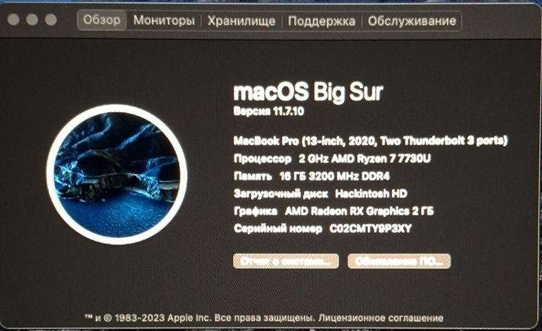
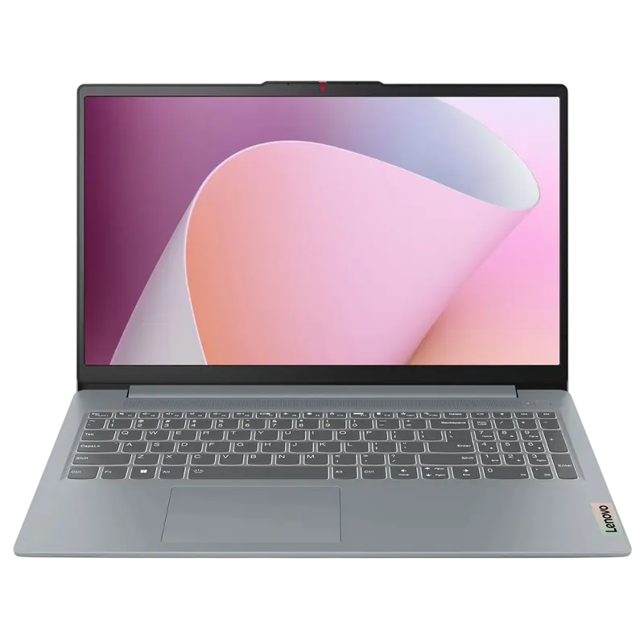

  
  

OpenCore EFI for Lenovo IdeaPad Slim 3 16ABR8

🇷🇺[Read in Russian](README_RU.MD)

EFI configuration for running macOS on Lenovo IdeaPad Slim 3 16ABR8 (AMD Ryzen 7 7730U).
Designed and tested for macOS 11 Big Sur — stable performance with most hardware supported.

---

Features:

Fully functional macOS 11 Big Sur installation

Stable CPU and iGPU graphics acceleration

Working audio, keyboard, trackpad, USB, and storage

Proper sleep, wake, and power management

---

Limitations:

Supported macOS: Big Sur (11) only

Monterey (12): Installer freezes at around 13–12 minutes remaining

Ventura (13+) and newer: Cannot install or boot

Not working:

• Built-in camera (unsupported)

• Wi‑Fi and Bluetooth (unsupported chipset)

• Battery percentage indicator (requires additional kext; planned for future updates)

---

Installation Notes:

Press Space in the OpenCore boot picker to reveal macOS installers

Battery percentage is currently not visible due to missing driver support

EFI may be updated in the future to improve hardware compatibility

---

Compatibility Table:

macOS Version	Status	Notes

Big Sur 11	✅ Fully Supported	Stable and functional

Monterey 12	⚠️ Installation hangs	Freezes at around 13–12 minutes remaining

Ventura 13+	❌ Unsupported	Cannot install or boot

---

FAQ:

Q: Why only Big Sur?
A: Monterey and later versions currently fail due to unresolved compatibility issues. Big Sur remains the most stable release for this hardware.

Q: Will Wi‑Fi or Bluetooth be supported?
A: Not with the current hardware; chipset drivers are not available.

Q: Battery percentage is missing — can I fix it?
A: Requires an additional kext, planned for a future EFI update.
