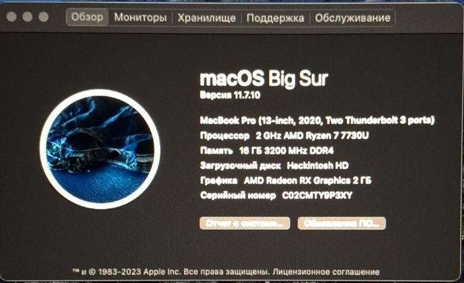

  

---

### Примечание:
В настоящее время проводится тестирование **macOS Catalina (10.15)** — среда восстановления успешно загружается.  
Если установка и запуск системы пройдут успешно, данная EFI будет также поддерживать Catalina.

OpenCore EFI для Lenovo IdeaPad Slim 3 16ABR8

🇬🇧[Read in English](./README.md)

EFI для запуска macOS на Lenovo IdeaPad Slim 3 16ABR8 (AMD Ryzen 7 7730U).
Оптимизировано для macOS 11 Big Sur — стабильная работа с поддержкой большинства компонентов.

---

Возможности:

Полностью работоспособная установка macOS 11 Big Sur

Стабильная работа CPU и iGPU с графическим ускорением

Работают звук, клавиатура, тачпад, USB и накопители

Корректный сон, пробуждение и управление питанием

---

Ограничения:

Поддерживаемая macOS: только Big Sur (11)

Monterey (12): установка зависает на примерно 13–12 минутах

Ventura (13+) и новее: установка и загрузка невозможны

Не работает:

• встроенная камера (нет поддержки)

• Wi‑Fi и Bluetooth (неподдерживаемый чипсет)

---

Примечания по установке:

В меню загрузки OpenCore нажмите Space, чтобы увидеть установщики macOS

EFI будет обновляться по мере появления новых kext для улучшения совместимости

---

Таблица совместимости:

Версия macOS	Статус	Примечания

Big Sur 11	✅ Полностью работает	Стабильная и функциональная

Monterey 12	⚠️ Установка зависает	Останавливается на 13–12 минутах

Ventura 13+	❌ Не поддерживается	Установка и загрузка невозможны

---

FAQ:

Q: Почему только Big Sur?
A: Monterey и более новые версии пока не устанавливаются из-за проблем совместимости. Big Sur — наиболее стабильная версия для данного устройства.

Q: Будут ли работать Wi‑Fi и Bluetooth?
A: Нет, драйверы для текущего чипсета недоступны.

